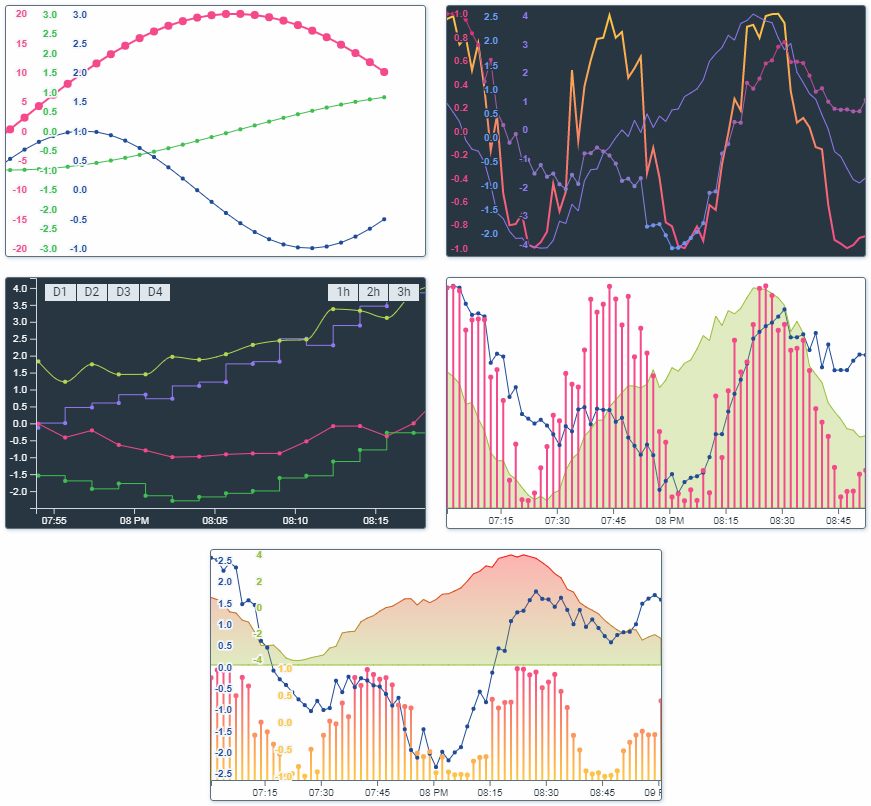

# d3-timeseries-multi-chart 

> Chart for multi timeseries datastreams.

## Demo

[ >> [Online demo](https://avin.github.io/d3-timeseries-multi-chart) << ]

[](https://avin.github.io/d3-timeseries-multi-chart)

## Install

```bash
# Yarn
yarn add @avinlab/d3-timeseries-multi-chart

# NPM
npm install --save @avinlab/d3-timeseries-multi-chart
```

## Usage

```js
import TimeseriesMultiChart from '@avinlab/d3-timeseries-multi-chart';

const chart = new TimeseriesMultiChart({
    target: '#chartContainer',
    chartDuration: 3600 * 1000,
    width: 800,
    height: 600,
    showTimeAxis: false,
});
chart.render([
    {
        label: 'Data 1',
        color: '#F5498B',
        data: [
            [new Date('2019-01-05 13:00:00'), 1.5],
            [new Date('2019-01-05 13:01:00'), 1.2],
            [new Date('2019-01-05 13:02:00'), 1.0],
            [new Date('2019-01-05 13:03:00'), 0.5],
        ],
        showAxis: true,
        strokeWidth: 2,
    },
    {
        label: 'Data 2',
        color: '#43BF4D',
        data: [
            [new Date('2019-01-05 13:00:00'), 3.2],
            [new Date('2019-01-05 13:01:00'), 1.2],
            [new Date('2019-01-05 13:02:00'), 5.2],
            [new Date('2019-01-05 13:03:00'), 1.2],
        ],
        showAxis: true,
        showDots: true,
    },
]);
```

## API

### Chart options

* `target` _(String|Element)_ - target element to mount chart svg (default: `#chart`).
* `width` _(Number)_ - width of chart (default: 500).
* `height` _(Number)_ - height of chart (default: 300).
* `chartDuration` _(Number)_ - default chart duration (default: `3600000` (1hour)).
* `showTimeAxis` _(Boolean)_ - show time axis.
* `timeAxisHeight` _(Number)_ - time axis height (default: `20`).
* `tipTimeWidth` _(Number)_ - tip time width (default: `125`).
* `tipTimeFormat` _(String)_ - tip time dateTime format string (default: `%Y-%m-%d %H:%M:%S`).
* `commonDataAxis` _(Boolean)_ - common axis for data lines.
* `commonDataAxisWidth` _(Number)_ - width of common data axis (default: `30`).
* `autoScale` _(Boolean)_ - auto scale data points of visible part.
* `chartPaddingFactor` _(Number)_ - data lines padding factor : 1/N of chart height (less is more) (default: `30`).

### Chart data item options

* `label` _(String)_ - DataStream human name.
* `color` _(String)_ - hex color string for data line.
* `data` _(Array)_ - array of data values. Array item structure: [date: DateTime, value: Number].
* `showAxis` _(Boolean)_ - Show Y axis for current dataStream.
* `strokeWidth` _(Number)_ - Stroke width of data line.
* `showDots` _(Boolean)_ - Show data points on data line.
* `dotsRadius` _(Number)_ - Data points radius (default: x2 of strokeWidth).
* `type` _(String)_ - Type of data line (`line`|`area`|`bar`).
* `areaFillOpacity` _(Number)_ - Opacity factor for color filling of area data line type.
* `curve` _(String)_ - Data line curve type (`linear`|`stepAfter`|`stepBefore`|`monotoneX`).

## License

MIT © [avin](https://github.com/avin)
